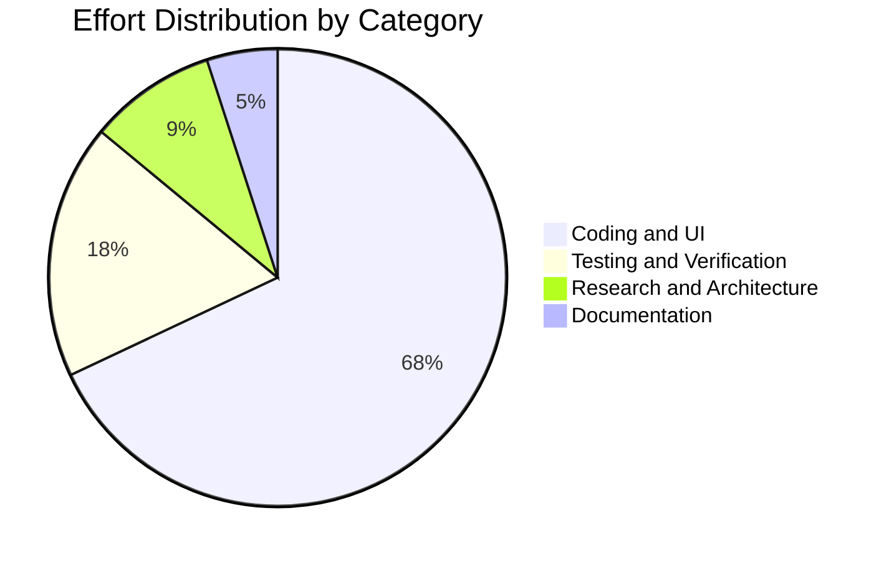
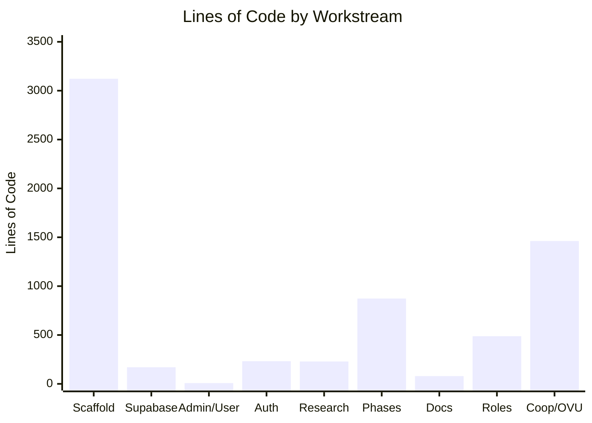

# CodeWithKris - Project Summary

## Project

- **Name:** CodeWithKris Mobile/Web Application Prototype
- **Repository:** `roger64s/CodeWithKris`
- **Date measured:** 2026-08-30
- **Scope:** CodeWithKris repository only. Grad-a-Gig Website files and metrics are excluded.
- **Production URL:** https://codewithkris.vercel.app

## Today's Metrics

| Metric | Committed to date | Pending locally | Total observed |
| --- | ---: | ---: | ---: |
| Commits | 23 | 0 | 23 |
| Text lines added | 7,265 | 0 | 7,265 |
| Text lines deleted | 602 | 0 | 602 |
| Net text-line change | 6,663 | 0 | 6,663 |
| New source files | 5 | 0 | 5 |
| Build status | Passed | Passed | Passed |

[Open the interactive CodeWithKris project metrics](charts.html)

## Delivered Today

- Built the CodeWithKris responsive application prototype.
- Added sign-in-first and registration flows with email-verification checkpoint.
- Added User, Admin, and Cooperative Financial demo views.
- Added role-based user registration covering 9 comprehensive categories: Persons with Disabilities (PWD), Student, Woman/Carer, Individual, Mentor, Corporate, Investor, NGO, and Government.
- Added exclusive CodeWithKris Administrator role validation for `roger.s@gradagig.com`.
- Redesigned registration into squarish category icon boxes with progressive disclosure and dynamic category collapse to eliminate page scrolling.
- Implemented role-specific conditional speech condition dropdowns (shown exclusively for PWDs).
- Added role-specific dashboard greetings, subtitles, and profile metadata badges.
- Implemented the AMUL-inspired cooperative sweat-equity computation engine with EVM 18-decimal precision units.
- Implemented the Outcome Valuation Unit (OVU) Matrix with base tiers and dynamic bonuses/penalties (+25% Reusability, +15% Speed, -30% Quality Penalty).
- Implemented Web Crypto API SHA-256 data hashing for privacy-preserving, zero-knowledge on-chain L2 testnet audit proof generation.
- Added Supabase Row Level Security (RLS) policies protecting sensitive financial metrics, cap table records, and PII while allowing public transparency for on-chain audit hashes.
- Audited all desktop application and document screens within a single viewport without document or nested scrolling.

## Effort Estimate

| Category | Estimated share |
| --- | ---: |
| Coding and UI implementation | 68% |
| Testing and browser validation | 18% |
| Research and product design | 9% |
| Documentation and release preparation | 5% |

Estimated active work window: approximately 6 hours 15 minutes across implementation, authentication, layout, role management, cooperative finance, L2 privacy hashing, and browser-audit sessions. This is an estimate from Git timestamps and session activity, not a timesheet.

## Current State

- Latest closeout release includes full cooperative sweat-equity, OVU calculation matrix, Web Crypto audit hashing, and responsive role registration.
- Production deployment: Vercel production site is live at https://codewithkris.vercel.app
- Closeout validation: `npm run build` passed cleanly with Vite and TypeScript.
- The all-pages no-scroll layouts and 12-screen browser audit are included in this release.
- The Vite build emits `docs/charts.html` into production output so the Gradagig CodeWithKris metrics link does not return 404.
- Production sign-in requires `VITE_SUPABASE_URL` and `VITE_SUPABASE_ANON_KEY` in Vercel project settings.
- The preview URL `codewithkris-roger-e1a3.vercel.app` is protected by Vercel Authentication; anonymous production checks use the public alias.

## Separation Rule

This document reports CodeWithKris only. Do not combine these metrics with the Grad-a-Gig Website project, its `origin/master` branch, its `docs/PROJECT_SUMMARY.md`, or its website assets.
