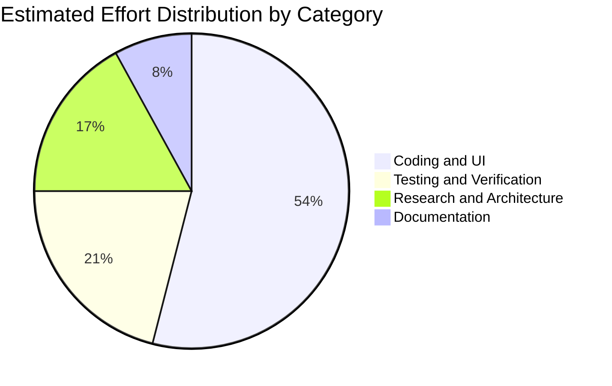
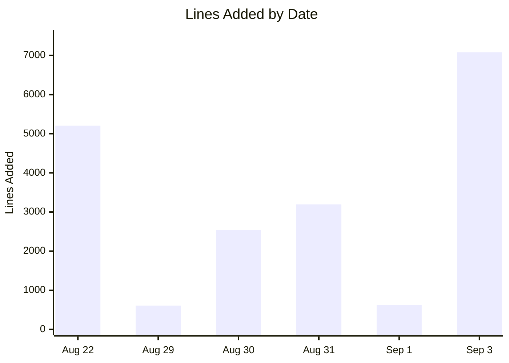

# CodeWithKris - Project Summary

## Project

- **Name:** CodeWithKris Mobile/Web Application Prototype
- **Repository:** `roger64s/CodeWithKris`
- **Date measured:** 2026-09-03, through this closeout release
- **Scope:** CodeWithKris repository only. Grad-a-Gig Website files and metrics are excluded.
- **Production URL:** https://codewithkris.vercel.app

## Today's Metrics

| Metric | Through implementation release |
| --- | ---: |
| Commits | 37 |
| Text lines added | 19,244 |
| Text lines deleted | 1,913 |
| Net text-line change | 17,331 |
| Build status | Passed |

[Open the interactive CodeWithKris project metrics](charts.html)

## Delivered Today

- Built the CodeWithKris responsive application prototype.
- Added sign-in-first and registration flows with email-verification checkpoint.
- Added User, Admin, and Cooperative Financial demo views.
- Added role-based user registration covering 9 comprehensive categories: Persons with Disabilities (PWD), Student, Woman/Carer, Individual, Mentor, Corporate, Investor, NGO, and Government.
- Added exclusive CodeWithKris Administrator role validation for `roger.s@gradagig.com`.
- Redesigned registration into squarish category icon boxes with progressive disclosure and dynamic category collapse to eliminate page scrolling.
- Removed the speech-condition question from initial PWD account creation.
- Added role-specific dashboard greetings, subtitles, and profile metadata badges.
- Implemented the AMUL-inspired cooperative sweat-equity computation engine with EVM 18-decimal precision units.
- Implemented the Outcome Valuation Unit (OVU) Matrix with base tiers and dynamic bonuses/penalties (+25% Reusability, +15% Speed, -30% Quality Penalty).
- Implemented Web Crypto API SHA-256 data hashing for privacy-preserving, zero-knowledge on-chain L2 testnet audit proof generation.
- Added Supabase Row Level Security (RLS) policies protecting sensitive financial metrics, cap table records, and PII while allowing public transparency for on-chain audit hashes.
- Removed fabricated treasury, dividend, contributor, and L2 figures from the cooperative dashboard.
- Added a contribution ledger seeded with Roger's founder/platform work, Abhinaya's logo design, and Josy Chow's PwD ambassador audio recordings, with unverified hours and OVUs explicitly left pending.
- Added separate authenticated workflows for categorized effort hours and financial investments, including Client Code, Project Code, department allocation, evidence, supplier, currency, and receipt references.
- Documented Roger's USD 2,500+ operating investment as a minimum pending receipt-level allocation rather than inventing an expense breakdown.
- Bound new records to the authenticated Supabase user ID and email while restricting aggregate reporting to management and authorized investors.
- Added management-controlled stakeholder assignments and based OVU calculations on the assigned cap-table category rather than the registration role.
- Applied the contribution, investment, stakeholder-assignment, signup-trigger, and RLS schema to production Supabase.
- Backfilled the existing founder account into Founders & Core Operating Team and configured Community Trust defaults for future registrations.
- Deployed and verified the functional application on Vercel, then removed the temporary schema endpoint and token.
- Audited all desktop application and document screens within a single viewport without document or nested scrolling.
- Restored the Supabase ledger schema to the prior policy creation structure after the repeatable-schema change affected the cooperative contribution flow.
- Added Universal Foundation, flexible commercial task tracks, and Applied AI & Workflow Execution phases with practical artifacts and intent mapping.
- Added 11 mission cards across the 3/4/4 phase structure, with module-specific voice-practice prompts.
- Added selectable Lead Generation, Appointment Fixing, Follow-Up Management, and Customer Service scenario trials with optional AI coaching.
- Added formative learning-pod evidence for mentorship, tool utilization, collaboration, and iteration without learner ranking.
- Replaced generic learner progress with Cooperative Readiness, client-impact metrics, and live sprint-eligibility states without invented activity.
- Added a producer-owner peer-review queue for commercial and technical work samples, constructive revision feedback, and protected reviewer/submitter email fields.
- Added the configurable GTM Pilot workflow for client briefs, diverse assignments, anonymized targets, approved multilingual outreach, conversion tracking, milestone compensation, revenue success fees, and OVU evidence.
- Added a production-ready CRM migration for companies, contacts, owner history, team pods, audit triggers, indexed access paths, and owner-scoped RLS.
- Added visible Company, Contact, and Contribution workspace views backed by the owner-scoped CRM and contribution tables.
- Added an authenticated Vercel API for private dictionary, recording, audio-storage, and practice-session persistence using Supabase user JWTs rather than a service-role bypass.
- Linked Coop Equity company and contact records to GTM Pilot targets with foreign keys, matching selectors, and company/contact consistency validation.
- Removed the obsolete “+ Contribute” navigation entry while retaining the current authorized Coop Equity workspace.
- Added required first-login profile onboarding after email verification for every user category, covering demographics, accessibility context, languages, skills, aspirations, hobbies, and consent.
- Added an owner-only Supabase profile table with automatic signup and voluntary inactivity dates, RLS protection, and database-enforced completion rules.
- Added operational roles that remain separate from registration categories, with secure project membership and mentor oversight boundaries.
- Added hierarchical Requirements Management with collaborative rich-text editing, automatic traceability, and impact analysis.
- Added public/private planning folders, releases, sprints, task assignment, and controlled reviewer-approved Kanban transitions.
- Added requirement-derived test cases, environment variants, evidence-backed test execution, and automatic linked defects.
- Added immutable release baselines, structured differences, and live project activity analytics.
- Linked Coop Equity effort to CRM Clients, Requirements Projects, and optional sprint tasks so approved contributions feed lifecycle activity.
- Added the Grad-a-Gig Operations workspace for scope, prefunding, milestones, inclusive human-reviewed matching, delivery quality, protected contributor distributions, impact, and PDCA.
- Made Coop Equity permanently visible in authenticated navigation and embedded its project-linked approved hours and weighted units in Operations.
- Added a hybrid local-partner and foreign-client responsibility map using the existing six cost-control departments and allocation percentages.
- Added workspace-seeded database mappings, RLS-protected updates, and automatic sprint-task responsibility derivation from the selected department.
- Added a responsive Operations panel for viewing and editing each department's primary party and local/client task scope.
- Added durable private playback, transcription correction, consent provenance, and progress evidence for every recorded or uploaded audio sample.
- Implemented configurable MFCC, delta, and delta-delta extraction with a two-hidden-layer MLP and multiclass probabilities.
- Added speaker-disjoint stratified 80/20 evaluation with dynamic accuracy, precision, recall, F1, confusion matrix, and classifier latency metrics.
- Added optional diarization with separately reported latency and conversational turn evidence.
- Added inclusion-first curation gates for consent, dual human review, adjudication, Krippendorff's alpha, VAD/clipping review, and retention-bias auditing.
- Replaced the hardcoded Appointment Fixing pipeline with versioned task configurations for Lead Generation, Appointment Fixing, Follow-Up Management, and Customer Service.
- Added task-aware model artifacts, API routing, recording provenance, flexible Supabase state storage, and tests proving non-appointment model training.

## Effort Estimate

| Category | Estimated share |
| --- | ---: |
| Coding and UI implementation | 54% |
| Testing and browser validation | 21% |
| Research and product design | 17% |
| Documentation and release preparation | 8% |

Estimated active work window: approximately 32 hours across implementation, authentication, layout, role management, contribution tracking, cooperative finance, stakeholder assignment, action trials, readiness, peer review, GTM, CRM, lifecycle governance, hybrid partner/client operations, audio/ML engineering, security hardening, deployment, and browser-audit sessions. This is an estimate from Git and Copilot session timestamps, not a timesheet.

## Current State

- This release includes authenticated effort and expense tracking, stakeholder-category OVU calculation, commercial task trials, formative pod progress, peer review, GTM pilots, CRM, a complete Requirements-to-release lifecycle, Grad-a-Gig project operations, and department-level local-partner/foreign-client responsibility mapping.
- The current learning model uses Universal Foundation, Commercial Task Tracks, and Applied AI & Workflow Execution, with human-reviewed action evidence rather than learner ranking.
- Production deployment: Vercel production site is live at https://codewithkris.vercel.app
- Closeout validation: `npm run build` passed cleanly with Vite and TypeScript.
- The all-pages no-scroll layouts and 12-screen browser audit are included in this release.
- The Vite build emits `docs/charts.html` into production output so the Gradagig CodeWithKris metrics link does not return 404.
- Production sign-in requires `VITE_SUPABASE_URL` and `VITE_SUPABASE_ANON_KEY` in Vercel project settings.
- The contribution, investment, stakeholder-assignment, signup-trigger, and RLS schema is deployed to production Supabase; persistent tracking is ready for authenticated production use.
- Production verification found 3 baseline contribution records, 1 documented investment record, and the founder account assigned to Founders & Core Operating Team.
- The preview URL `codewithkris-roger-e1a3.vercel.app` is protected by Vercel Authentication; anonymous production checks use the public alias.
- August 31 maintenance restores the cooperative contribution ledger schema structure while retaining the SQL syntax correction for the anonymous audit proof table.
- The authenticated Vercel API and required Supabase environment variables are configured for production deployment.
- All required Supabase SQL migrations were reported successfully applied on 2026-09-03, including action-based evaluation and commercial track constraints.
- The current release removes the obsolete user-facing “+ Contribute” route while keeping Coop Equity permanently visible in authenticated navigation and integrated into Client Project operations.
- Company and contact records can be assigned to GTM targets; the GTM workflow migration enforces matching target links and must be applied after the CRM migration.
- Verified users without a completed profile are routed to private first-login onboarding before accessing the application.
- The audio pipeline is configuration-driven and supports four commercial tracks without hardcoded database state enums; model artifacts remain undeployed until representative consented audio is curated and measured.
- Closeout validation passed 18 Python tests, explicit manifest curation, Node syntax checking, TypeScript/Vite production build, and workspace diagnostics.

## Separation Rule

This document reports CodeWithKris only. Do not combine these metrics with the Grad-a-Gig Website project, its `origin/master` branch, its `docs/PROJECT_SUMMARY.md`, or its website assets.
