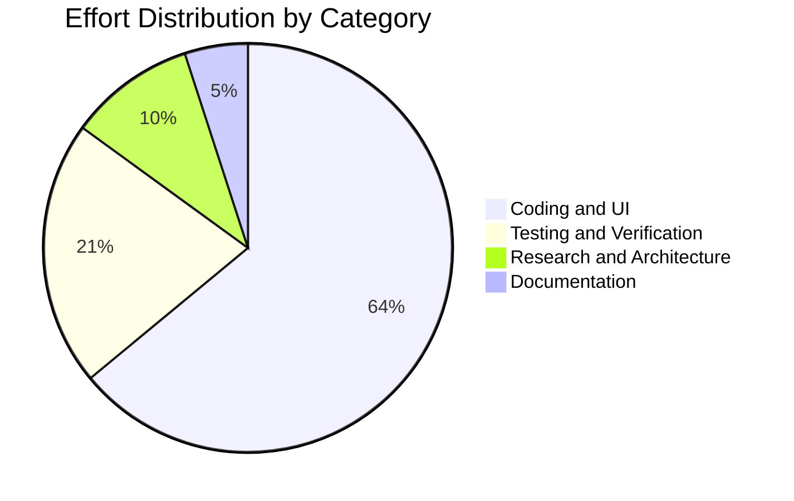
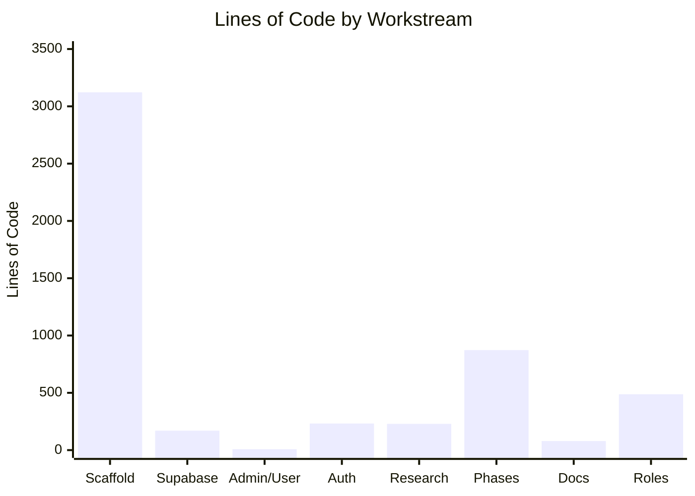

# CodeWithKris - Project Summary

## Project

- **Name:** CodeWithKris Mobile/Web Application Prototype
- **Repository:** `roger64s/CodeWithKris`
- **Date measured:** 2026-08-29
- **Scope:** CodeWithKris repository only. Grad-a-Gig Website files and metrics are excluded.
- **Production URL:** https://codewithkris.vercel.app

## Today's Metrics

| Metric | Committed to date | Pending locally | Total observed |
| --- | ---: | ---: | ---: |
| Commits | 17 | 0 | 17 |
| Text lines added | 5,696 | 0 | 5,696 |
| Text lines deleted | 340 | 0 | 340 |
| Net text-line change | 5,356 | 0 | 5,356 |
| New source files | 2 | 0 | 2 |
| Build status | Passed | Passed | Passed |

[Open the interactive CodeWithKris project metrics](charts.html)

## Delivered Today

- Built the CodeWithKris responsive application prototype.
- Added sign-in-first and registration flows with email-verification checkpoint.
- Added User and Admin demo views.
- Added role-based user registration with six primary roles: Student, Woman/Carer, Investor, Mentor, Corporate, and Individual.
- Added exclusive CodeWithKris Administrator role validation for `roger.s@gradagig.com`.
- Added role-specific dashboard greetings, subtitles, and profile metadata badges.
- Added Supabase persistence for dictionary words, practice sessions, and private voice recordings.
- Added functional audio-file upload with save/error states.
- Added business practice missions for client briefs, project status updates, QA handoffs, and coding/pair programming.
- Added Euphonia, Duolingo, and Quorum research recommendations.
- Added the AI/ML accessibility audit and copyright/licensing register.
- Added a visible three-phase pathway with phase-specific task grouping and left-side navigation.
- Improved authenticated-page spacing and enlarged the application logo.
- Added a dashboard-first post-login experience with phase-specific mission selection.
- Added Supabase Auth credential validation, session restoration, email-verification registration, and sign-out.
- Fitted the sign-in and initial authenticated dashboard into a desktop browser viewport without page scrolling.
- Reduced the sign-in action to a compact, content-sized button.
- Fitted Record and Practice into compact two-column desktop workspaces.
- Fitted all eight Admin template statistics and recent activity above the fixed navigation.
- Reformatted the Volunteer Agreement into two semantic columns without splitting its commitment list.
- Audited 12 public and authenticated screens at 1440×660 with zero document or nested scroll regions.

## Effort Estimate

| Category | Estimated share |
| --- | ---: |
| Coding and UI implementation | 64% |
| Testing and browser validation | 21% |
| Research and product design | 10% |
| Documentation and release preparation | 5% |

Estimated active work window: approximately 4 hours 55 minutes across implementation, authentication, layout, role management, and browser-audit sessions. This is an estimate from Git timestamps and session activity, not a timesheet.

## Current State

- Latest committed release: `0882e5b Add role-based registration and CodeWithKris Administrator category`.
- Production deployment: Vercel production site is live at https://codewithkris.vercel.app
- Closeout validation: `npm run build` passed cleanly with Vite and TypeScript.
- The all-pages no-scroll layouts and 12-screen browser audit are included in this release.
- The Vite build emits `docs/charts.html` into production output so the Gradagig CodeWithKris metrics link does not return 404.
- Production sign-in requires `VITE_SUPABASE_URL` and `VITE_SUPABASE_ANON_KEY` in Vercel project settings.
- The preview URL `codewithkris-roger-e1a3.vercel.app` is protected by Vercel Authentication; anonymous production checks use the public alias.
- Production MFCC/MLP/Softmax inference, Supabase RLS and per-user data ownership, external channel adapters, community features, and employer workflows remain future phases.

## Separation Rule

This document reports CodeWithKris only. Do not combine these metrics with the Grad-a-Gig Website project, its `origin/master` branch, its `docs/PROJECT_SUMMARY.md`, or its website assets.
