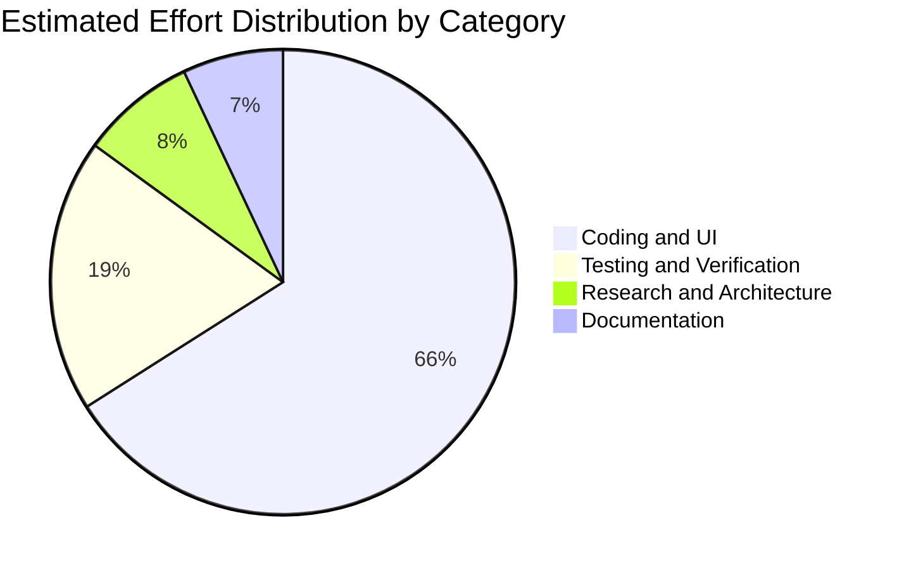
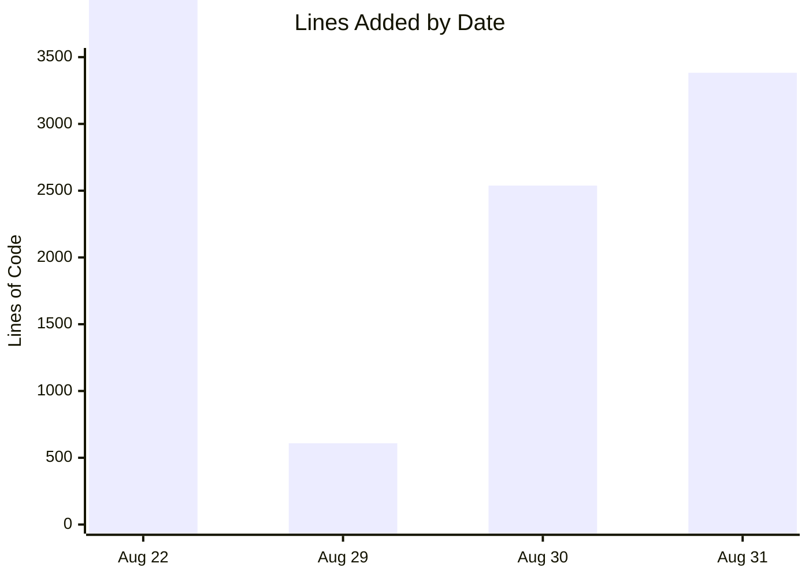

# CodeWithKris - Project Summary

## Project

- **Name:** CodeWithKris Mobile/Web Application Prototype
- **Repository:** `roger64s/CodeWithKris`
- **Date measured:** 2026-08-31
- **Scope:** CodeWithKris repository only. Grad-a-Gig Website files and metrics are excluded.
- **Production URL:** https://codewithkris.vercel.app

## Today's Metrics

| Metric | Committed to date | Pending locally | Total observed |
| --- | ---: | ---: | ---: |
| Commits | 28 | 1 corrective update | 29 after publication |
| Text lines added | 11,548 | 190 | 11,738 |
| Text lines deleted | 1,277 | 21 | 1,298 |
| Net text-line change | 10,271 | 169 | 10,440 |
| New release files | 10 | 1 | 11 |
| Build status | Passed | Passed | Passed |

[Open the interactive CodeWithKris project metrics](charts.html)

## Delivered Today

- Built the CodeWithKris responsive application prototype.
- Added sign-in-first and registration flows with email-verification checkpoint.
- Added User, Admin, and Cooperative Financial demo views.
- Added role-based user registration covering 9 comprehensive categories: Persons with Disabilities (PWD), Student, Woman/Carer, Individual, Mentor, Corporate, Investor, NGO, and Government.
- Added exclusive CodeWithKris Administrator role validation for `roger.s@gradagig.com`.
- Redesigned registration into squarish category icon boxes with progressive disclosure and dynamic category collapse to eliminate page scrolling.
- Implemented role-specific conditional speech condition dropdowns (shown exclusively for PWDs).
- Added role-specific dashboard greetings, subtitles, and profile metadata badges.
- Implemented the AMUL-inspired cooperative sweat-equity computation engine with EVM 18-decimal precision units.
- Implemented the Outcome Valuation Unit (OVU) Matrix with base tiers and dynamic bonuses/penalties (+25% Reusability, +15% Speed, -30% Quality Penalty).
- Implemented Web Crypto API SHA-256 data hashing for privacy-preserving, zero-knowledge on-chain L2 testnet audit proof generation.
- Added Supabase Row Level Security (RLS) policies protecting sensitive financial metrics, cap table records, and PII while allowing public transparency for on-chain audit hashes.
- Removed fabricated treasury, dividend, contributor, and L2 figures from the cooperative dashboard.
- Added a contribution ledger seeded with Roger's founder/platform work, Abhinaya's logo design, and Josy Chow's PwD ambassador audio recordings, with unverified hours and OVUs explicitly left pending.
- Added separate authenticated workflows for categorized effort hours and financial investments, including Client Code, Project Code, department allocation, evidence, supplier, currency, and receipt references.
- Documented Roger's USD 2,500+ operating investment as a minimum pending receipt-level allocation rather than inventing an expense breakdown.
- Bound new records to the authenticated Supabase user ID and email while restricting aggregate reporting to management and authorized investors.
- Added management-controlled stakeholder assignments and based OVU calculations on the assigned cap-table category rather than the registration role.
- Applied the contribution, investment, stakeholder-assignment, signup-trigger, and RLS schema to production Supabase.
- Backfilled the existing founder account into Founders & Core Operating Team and configured Community Trust defaults for future registrations.
- Deployed and verified the functional application on Vercel, then removed the temporary schema endpoint and token.
- Audited all desktop application and document screens within a single viewport without document or nested scrolling.
- Restored the Supabase ledger schema to the prior policy creation structure after the repeatable-schema change affected the cooperative contribution flow.
- Added a five-question Frontend, Backend, or DevOps diagnostic with JSON results and free three-phase learning pathways.
- Replaced generic learner progress with Cooperative Readiness, client-impact metrics, and live sprint-eligibility states without invented activity.
- Added a producer-owner peer-review queue with focused code submissions, constructive revision feedback, and protected reviewer/submitter email fields.
- Added the configurable GTM Pilot workflow for client briefs, diverse assignments, anonymized targets, approved multilingual outreach, conversion tracking, milestone compensation, revenue success fees, and OVU evidence.
- Added a production-ready CRM migration for companies, contacts, owner history, team pods, audit triggers, indexed access paths, and owner-scoped RLS.
- Added visible Company, Contact, and Contribution workspace views backed by the owner-scoped CRM and contribution tables.
- Added an authenticated Vercel API for private dictionary, recording, audio-storage, and practice-session persistence using Supabase user JWTs rather than a service-role bypass.

## Effort Estimate

| Category | Estimated share |
| --- | ---: |
| Coding and UI implementation | 66% |
| Testing and browser validation | 19% |
| Research and product design | 8% |
| Documentation and release preparation | 7% |

Estimated active work window: approximately 12.5 hours across implementation, authentication, layout, role management, contribution tracking, cooperative finance, stakeholder assignment, diagnostics, readiness, peer review, GTM, CRM, security hardening, deployment, and browser-audit sessions. This is an estimate from Git and Copilot session timestamps, not a timesheet.

## Current State

- This closeout release includes authenticated effort and expense tracking, stakeholder-category OVU calculation, readiness diagnostics, peer review, GTM pilots, CRM migrations, and a Vercel-compatible authenticated API.
- Production deployment: Vercel production site is live at https://codewithkris.vercel.app
- Closeout validation: `npm run build` passed cleanly with Vite and TypeScript.
- The all-pages no-scroll layouts and 12-screen browser audit are included in this release.
- The Vite build emits `docs/charts.html` into production output so the Gradagig CodeWithKris metrics link does not return 404.
- Production sign-in requires `VITE_SUPABASE_URL` and `VITE_SUPABASE_ANON_KEY` in Vercel project settings.
- The contribution, investment, stakeholder-assignment, signup-trigger, and RLS schema is deployed to production Supabase; persistent tracking is ready for authenticated production use.
- Production verification found 3 baseline contribution records, 1 documented investment record, and the founder account assigned to Founders & Core Operating Team.
- The preview URL `codewithkris-roger-e1a3.vercel.app` is protected by Vercel Authentication; anonymous production checks use the public alias.
- August 31 maintenance restores the cooperative contribution ledger schema structure while retaining the SQL syntax correction for the anonymous audit proof table.
- The authenticated Vercel API and required Supabase environment variables are configured for production deployment.
- `supabase/schema.sql`, `supabase/gtm_pilot_workflow.sql`, and `supabase/crm_schema.sql` are publication-ready; the two new standalone migrations still require application to the remote Supabase project because this workstation has no authenticated Supabase CLI session.

## Separation Rule

This document reports CodeWithKris only. Do not combine these metrics with the Grad-a-Gig Website project, its `origin/master` branch, its `docs/PROJECT_SUMMARY.md`, or its website assets.
